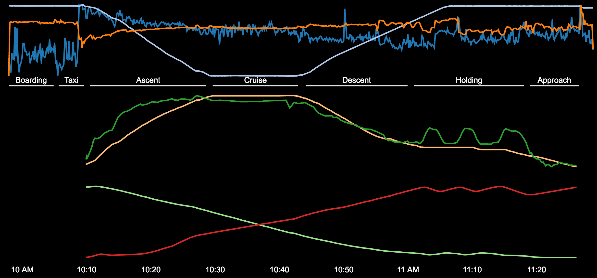

## Flight Timeline Visualised



You can view the content of this repo live [here](https://ewandennis.github.com/d3-flight-timeline).

## Setup

```bash
git clone https://github.com/ewandennis/d3-flight-timeline
cd d3-flight-timeline
bower install
```

Arrange for an HTTP server (because CORS):

```bash
npm install node-static -g
static -p 8000
```

[Visit localhost:8000 in your browser.](http://localhost:8000/)

### Notes

If you'd like to download the rendered SVG, uncomment the line which creates the download botton at the bottom of main.js.
